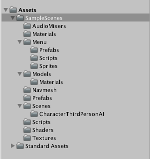
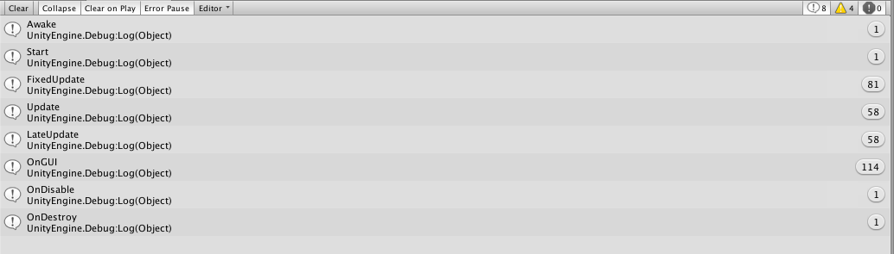
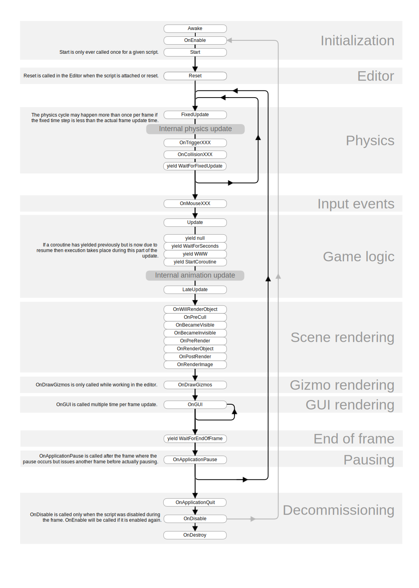
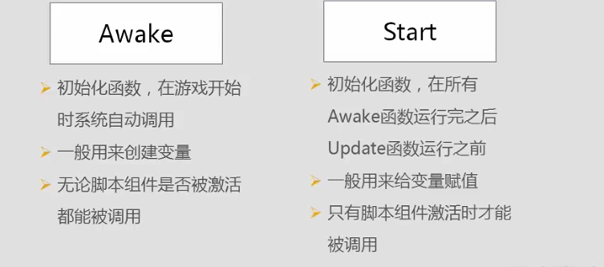
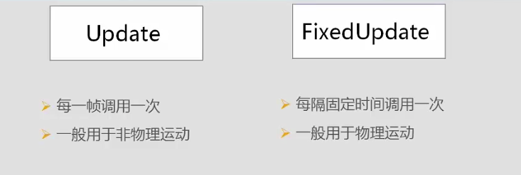
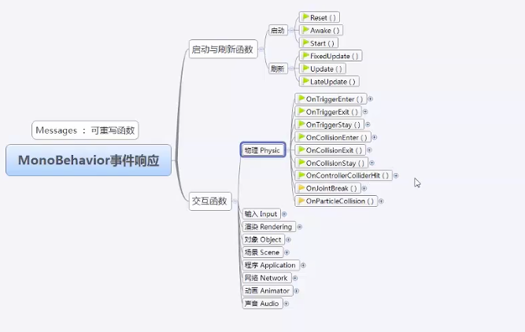
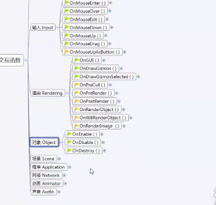
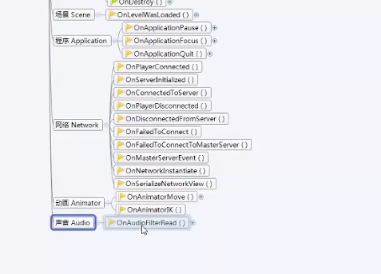
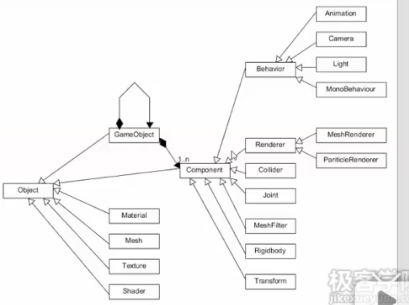
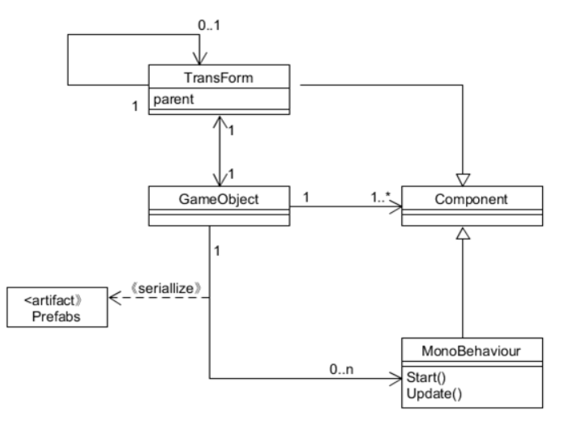

[TOC]

## Assignment 1

### 1、简答题

#### 1、解释 游戏对象（GameObjects） 和 资源（Assets）的区别与联系。

​	游戏对象 (GameObject)是所有其他组件 (Component)的容器。游戏中的所有对象本质上都是游戏对象 (GameObject)。游戏对象 (GameObject) 自身不会向游戏添加任何特性。而是容纳实现实际功能的组件 (Component) 的容器。对象一般有玩家、敌人、环境、摄像机和音乐等虚拟父类，这些父节点本身没有实体，但它们的子类真正包含了游戏中会出现的对象。

​	资源（Assets）不仅包括游戏对象，还包括各组件中的C#脚本文件，各种游戏场景，预设，GUI，Animation，material等，并且可以直接导入已经完成好的package，或者从场景中导出到package。在资源文件夹，通常有对象、材质、场景、声音、预设、贴图、脚本、动作，在这些文件夹下可以继续进行划分。

​	资源可以被多个游戏对象使用，资源整合的具体表现是直接出现在游戏场景的对象。有些资源作为模板，可实例化成游戏中具体的对象。

#### 2、下载几个游戏案例，分别总结资源、对象组织的结构（指资源的目录组织结构与游戏对象树的层次结构）




#### 3、编写一个代码，使用 debug 语句来验证MonoBehaviour基本行为或事件触发的条件

- ##### 基本行为包括 Awake() Start() Update() FixedUpdate() LateUpdate()

- ##### 常用事件包括 OnGUI() OnDisable() OnEnable()


```
Debug语句：

Debug.Log();

Debug.LogWarning();

Debug.LogError();
```


```
using System.Collections;
using System.Collections.Generic;
using UnityEngine;
public class Example : MonoBehaviour {
    void Awake () {
        Debug.Log ("Awake");
    }

    // Use this for initialization
    void Start () {
        Debug.Log ("Start");
    }
    
    // Update is called once per frame
    void Update () {
        Debug.Log ("Update");
    }

    void FixedUpdate () {
        Debug.Log ("FixedUpdate");
    }

    void LateUpdate () {
        Debug.Log ("LateUpdate");
    }

    void Reset () {
        Debug.Log ("Reset");
    }

    void OnGUI () {
        Debug.Log ("OnGUI");
    }

    void OnDestroy () {
        Debug.Log ("OnDestroy");
    }

    void OnDisable () {
        Debug.Log ("OnDisable");
    }
}
```




生命周期（）：	














LateUpdate() : 在每帧执行完毕调用，他在所有Update结束后才调用，比较适合于命令脚本的执行。官网上例子是摄像机的跟随，都是在所有Update操作完才跟进摄像机，不然就有可能出现摄像机已经推进了，但是视角里还未有角色的空帧出现。

OnEnable() : 当对象变为可用或激活状态时此函数被调用，OnEnable不能用于协同程序。（物体启动时被调用）

OnDisable() : 当对象变为不可用或非激活状态时此函数被调用。当物体销毁时它被调用，并且可用于任意清理代码。当脚本编译完成之后被重新加载时，OnDisable将被调用，OnEnable在脚本被载入后调用。（物体被禁用时调用）

OnGUI() : 绘制GUI时候触发。一般在这个函数里绘制GUI菜单。（GUI显示函数只能在OnGUI中调用）


#### 4、查找脚本手册，了解GameObject，Transform，Component 对象

- ##### 分别翻译官方对三个对象的描述（Description）


**GameObjects** are the fundamental objects in Unity that represent characters, props and scenery. They do not accomplish much in themselves but they act as containers for **Components**, which implement the real functionality.

​	游戏对象 (GameObject)是所有其他[组件 (Component)](http://docs.manew.com/Components/index.html) 的容器。游戏中的所有对象本质上都是游戏对象 (GameObject)。

​	游戏对象 (GameObject) 自身不会向游戏添加任何特性。而是容纳实现实际功能的组件 (Component) 的容器。例如，[光 (Light)](http://docs.manew.com/Components/class-Light.html) 是一个附加到游戏对象 (GameObject) 的组件 (Component)。

​	除了作为组件 (Component) 的容器之外，游戏对象 (GameObject) 还具有标记 (Tag)、层 (Layer) 和名称 (Name)。标记 (Tag) 用于通过标记 (Tag) 名称来快速查找对象。层 (Layer) 可用于仅对某些特定的对象组投射光线、渲染或应用光照。标记 (Tag) 和层 (Layer) 可以使用[标记管理器 (Tag Manager)](http://docs.manew.com/Components/class-TagManager.html)（在编辑 (Edit) ->项目设置 (Project Settings) -> 标记 (Tags) 中）进行设置。

​	在 Unity 中，游戏对象 (GameObject) 中有一个名为静态 (Static) 的复选框。此复选框用于：

- 准备静态几何结构以用于自动[批处理](http://docs.manew.com/Manual/DrawCallBatching.html)

- 计算[遮挡剔除 (Occlusion Culling)](http://docs.manew.com/Manual/OcclusionCulling.html)

  

  ​		**		生成遮挡 (Occlusion) 数据时使用“静态”(Static) 复选框*

生成遮挡 (Occlusion) 数据时，将游戏对象 (GameObject) 标记为静态 (Static) 会使其可以剔除（或禁用）在静态 (Static) 对象之后不可见的网格对象。因此，不会在场景中四处移动的所有环境对象都**应标记为**静态 (Static)。

​	游戏对象包括（菜单 GameObjects）：

- 空


- 3D物体（立方体 、 球体 、 胶囊 、 圆柱体 、 平面和四 边形 …）


- 2D物体（精灵/图片）


- 摄像机


- 灯光（平面，聚光，…）


- 音频


- UI 元素

- 粒子系统

  ...


**Components**：

​	所有游戏对象 (GameObjects) 自动包含一个变换组件 (Transform Component)。这是因为变换 (Transform) 组件决定了游戏对象 (GameObject) 的位置，以及它如何旋转和缩放。没有变换组件 (Transform Component)，游戏对象 (GameObject) 就不会存在于游戏世界中。

​	将一个组件 (Component) 连接到游戏对象 (GameObject) 时，该组件 (Component) 有不同的值或属性 (Properties)，这些值或属性在构建游戏时可以在编辑器里调整，或者在运行游戏时由脚本来调整。有两种主要类型的属性 （Properties）：值 (Values) 和引用 (References)。

​	脚本是您自己创建的一个组件 (Component)，您将定义其陈列在检视器 (Inspector) 中的元素，它会执行您写出的任何功能。

​	常用组件（系统菜单 Component）:

- 变换（必须）：物体空间的位置、角度、Scale 属性


- Mesh/网格：物体的形状与形态


- 物理：物体碰撞时需要的属性


- 音频组件


- 渲染组件


- 布局组件


- 动画组件

  ……


- 脚本组件（ MonoBehaviour ）


**Transform**:

​	变换 Component 决定场景中每个对象的位置 (Position) 、旋转 (Rotation) 和缩放 (Scale) 。每个对象都有一个变换 (Transform) 属性。

​	使用变换：通常在 X、Y 和 Z 轴的三维空间中控制变换 (Transform)。在 Unity 中，分别用红色、绿色和蓝色代表这些轴。请记住：XYZ = RGB。


​						三个轴和变换 (Transform) 属性之间的颜色编码关系*

​	父子化 (Parenting) 是使用 Unity 时需要理解的最重要的概念之一。当某个游戏对象 (GameObject) 是另一个游戏对象 (GameObject) 的父级 (Parent) 时，子级 (Child) 游戏对象 (GameObject) 会像其父级 (Parent) 一样移动、旋转和缩放。正如您的手臂与躯干相连，转动躯干时，手臂因为与其相连也会移动。任何对象都可以有多个子级，但却只能有一个父级。

​	您可以通过将层级视图 (Hierarchy View) 的任何游戏对象 (GameObject) 拖到另一个游戏对象上来创建一个父级 (Parent)。此操作会在两个游戏对象 (GameObject) 之间创建一种父子关系。


​			父子层级视图 (hierarchy) 示例。名称左侧有折叠箭头的游戏对象 (GameObjects) 是父级。*

​	上述示例中，我们认为躯干是手臂的父级而手臂是手的父级。您在 Unity 中制作的场景将包含这些变换层级 (Transform hierarchy)的集合。最上层的父级对象被称为根对象 (Root object)。当您移动、缩放或旋转某个父级对象时，其变换 (Transform) 中的所有变化都会被应用于其子级对象。

​	值得指出的是任何子级游戏对象 (Child GameObject) 的检视器 (Inspector) 中的变换 (Transform) 值都会相对于父级 (Parent) 的变换 (Transform) 值而显示。这些值又被称局部坐标 (Local Coordinate) 。您可以通过脚本处理访问全局坐标 (Global Coordinate) 和局部坐标 (local coordinate)。

​	您可以将多个单独的对象一起父子化来构建复合对象，例如，布娃娃的骨架结构。您还可以通过简单的层级实现有用的效果。例如，如果您有个夜间恐怖游戏，您就可以用手电筒创造有效气氛。要创建此对象，您要使手电筒变换 (Transform) 成为聚光灯变换 (Transform) 的父级。然后，手电筒变换 (Transform) 的任何修改都会影响聚光灯，创建一个逼真的手电筒效果。


- ##### 描述下图中 table 对象（实体）的属性、table 的 Transform 的属性、 table 的部件

  - 本题目要求是把可视化图形编程界面与 Unity API 对应起来，当你在 Inspector 面板上每一个内容，应该知道对应 API。
  - 例如：table 的对象是 GameObject，第一个选择框是 activeSelf 属性。


table的属性：

- Tag：Tag属性用于区分游戏中不同类型的对象，Tag可以理解为一类元素的标记，可用GameObject.FindWithTag()来查询对象。
- Layer
- Prefab

table的部件：

- Transform
- Cube
- Box Collider
- Mesh Renderer

table的transform的属性：

- Position（x,y,z）
- Rotation(x,y,z)
- Scale（1，1，1）


- ##### 用 UML 图描述 三者的关系（请使用 UMLet 14.1.1 stand-alone版本出图）








- ##### 整理相关学习资料，编写简单代码验证以下技术的实现：

  unity中提供了获取对象的五种方法：

  1. 通过对象名称（Find方法）：static GameObject **Find** (string name)
  2. 通过标签获取单个游戏对象（FindWithTag方法）：static GameObject **FindWithTag** (string tag) 
  3. 通过标签获取多个游戏对象（FindGameObjectsWithTags方法）：static GameObject[] **FindGameObjectsWithTag** (string tag)
  4. 通过类型获取单个游戏对象（FindObjectOfType方法）：static Object **FindObjectOfType**(Type type)
  5. 通过类型获取多个游戏对象（FindObjectsOfType方法）：static Object **FindObjectsOfType**(Type type)

  **注意：一定保证对象是active的才会找到**，**为了效率高，一定要保证别在每帧都调用的函数中使用上述函数**

  **传入的name可以是单个的对象的名字，也可以是hierarchy中的一个路径名，如果找到会返回该对象(活动的)，如果找不到就返回null。**


​	创建对象并添加tranform部件：

```
GameObject table = GameObject.CreatePrimitive(PrimitiveType.Cube);
table.name = "a table";
table.transform.position=new Vector3(0,Random.Range(0,5),0);
```

​	克隆对象：

```
public GameObject chair;

void Start() {
    for (int i = 0; i < 5; i++) {
        Instantiate(chair);
    }
}
```

​	添加子对象：

```
chair.transform.parent=table.transform;
```

​	遍历对象树：

```
foreach (Transform child in transform) {
	Debug.Log(child.gameObject.name);
}
```

​	清除所有子对象：

```
foreach (Transform child in transform) {
    GameObject.Destroy(child.gameObject);
}
```


- ##### 资源预设（Prefabs）与 对象克隆 (clone)

  - 预设（Prefabs）有什么好处？
  - 预设与对象克隆 (clone or copy or Instantiate of Unity Object) 关系？
  - 制作 table 预制，写一段代码将 table 预制资源实例化成游戏对象


​	预设（prefab）是一个对象的快照或模板，可以用于快速生成相同的对象，比如子弹、敌人等等。修改预设以后，通过该预设生成的对象也会发生变化。

​	而克隆只是复制一个一模一样的对象，这个对象独立于原来的对象，在修改的过程中不会影响原有的对象，这样不方便整体改动。

​	预设与克隆都能创建出相同的对象。预设创建出的对象与源预设依然有联系，后者的更改会影响到前者。但是克隆出的对象与源对象不再有联系。

```
针对每块砖使用预设 (Prefab),创建一堵砖墙:
public Transform brick;
void Start() {
	for (int y = 0; y < 5; y++) {
		for (int x = 0; x < 5; x++) {
			Instantiate(brick, new Vector3(x, y, 0), Quaternion.identity);
		}
	}
}
1. 选择游戏对象 (GameObject)->创建其他对象 (Create Other)->立方体 (Cube)
2. 选择组件 (Component)->物理 (Physics)->刚体 (Rigidbody)
3. 选择资源 (Assets)->创建 (Create)->预设 (Prefab)
4. 在工程视图 (Project View) 中，将新预设 (Prefab) 的名称更改为“砖 (Brick)”
5. 将您在层级视图 (Hierarchy) 中创建的立方体拖到工程视图 (Project View) 中的“砖 (Brick)” 预设 (Prefab) 上
6. 创建预设 (Prefab) 后，可以从层级视图 (Hierarchy) 安全删除立方体 (Cube)（Windows 上的删除 (Delete)，Mac 上的回退命令 (Command-Backspace)）

我们已经创建砖预设 (Brick Prefab)，现在需将其附加到脚本的砖变量上。选择包含脚本的空游戏对象 (GameObject)。请注意，检视器 (Inspector) 中将出现一个新变量，名为“砖”。
这个变量可以接受任何游戏对象 (GameObject) 或预设 (Prefab)
```


- ##### 尝试解释组合模式（Composite Pattern / 一种设计模式）。使用 BroadcastMessage() 方法

  - 向子对象发送消息


​	组合模式（Composite Pattern），又叫部分整体模式，是用于把一组相似的对象当作一个单一的对象。组合模式依据树形结构来组合对象，用来表示部分以及整体层次。这种类型的设计模式属于结构型模式，它创建了对象组的树形结构。这种模式创建了一个包含自己对象组的类。该类提供了修改相同对象组的方式。组合模式是将对象组合成树形结构以表示“部分-整体”的层次结构，它使得用户对单个对象和组合对象的使用具有一致性。
经典案例：系统目录结构，网站导航结构等

​	组合模式的使用，使得Unity离散引擎灵活、易于扩展；Component强组合于GameObject,使得内存空间管理富有效率，提高了性能。

​	一个对象可以由多个对象组成，而组合出的对象依然与正常的对象没有什么不同，操作组合对象与操作单一的对象的方式没什么不同，这就是组合模式（可以理解为1+1 == 1）。
​	组合模式允许你将对象组合成树形结构来表现“部分-整体”的层次结构，使得对象使用者以一致的方式处理单个对象以及对象的组合。（这个好处我们将会在[学习Unity(7)](https://www.jianshu.com/p/df7290dfc36b)体会到）

​	另外一个好处是，实现了组合模式以后，我们就可以忽略“部分”的存在了，我们只需要告诉“整体”要做什么，然后“整体”就会让每一个“部分”做好自己的事情。
​	让我们从组合模式的角度来看待电脑开机。如果说电脑是一个“整体”，那其中的CPU、内存等硬件就是“部分”。当我们想要开机的时候，我们需要告诉CPU、内存要怎么启动起来吗？不用，我们只需要按开机按钮，告诉电脑这个“整体”：我要开机。然后电脑就会让CPU、内存等硬件做自己的事情，最终把电脑启动起来。

我们通过BroadcastMessage来让“整体”发送消息给“部分”：

```
using System.Collections;
using System.Collections.Generic;
using UnityEngine;
using System;

public class ComputerScript : MonoBehaviour {

    // Use this for initialization
    void Start () {
        PushPowerButton();
    }

    void PushPowerButton() {
        print ("PowerButton of computer is pushed at "+time);
        gameObject.BroadcastMessage("Boot", System.DateTime.Now.ToString("yyyy/MM/dd HH:mm:ss")); 
    }
}

```

> System.DateTime.Now.ToString("yyyy/MM/dd HH:mm:ss")返回当前时间的string，这个它会作为以下每一个Boot的参数。

CPU收到消息以后执行自己的代码：

```
using System.Collections;
using System.Collections.Generic;
using UnityEngine;

public class CPUscript : MonoBehaviour {

    void Boot(string time) {
        print ("CPU is running. Boot time: "+ time);
    }
}

```

内存收到消息以后执行自己的代码：

```
using System.Collections;
using System.Collections.Generic;
using UnityEngine;

public class MemoryScript : MonoBehaviour {

    void Boot(string time) {
        print ("Memory is running. Boot time: "+ time);
    }
}
```


### 2、 编程实践，小游戏

- 游戏内容： 井字棋 或 贷款计算器 或 简单计算器 等等
- 技术限制： 仅允许使用 **IMGUI** 构建 UI
- 作业目的：
  - 提升 debug 能力
  - 提升阅读 API 文档能力


