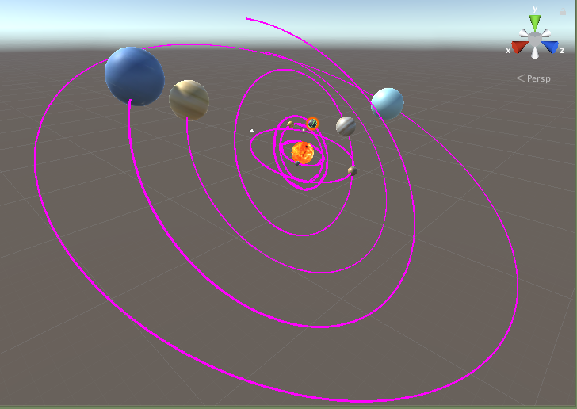
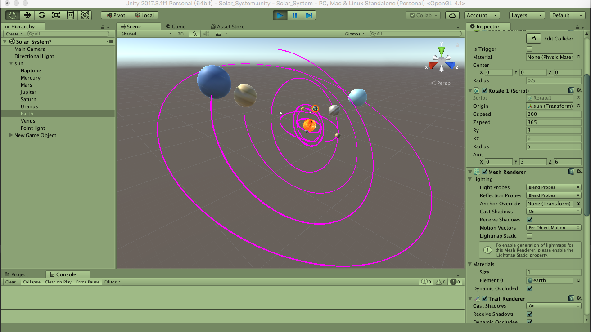
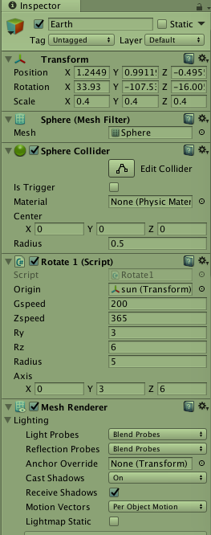
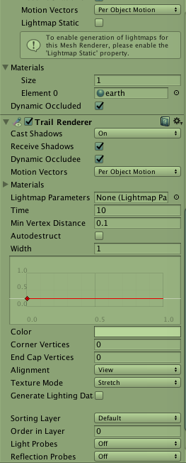

# 二、空间与运动

## 1、c# 自学

搜素 “c# 集合类型”， 了解以下类型的使用。 不知道使用，自己复习 C++ 模板库。

- List
- HashTable

不负责任的链接： http://blog.csdn.net/ceclar123/article/details/8655853

### List

**List<T> Initialization**

```c#
List<int> intList = new List<int>();
OR
IList<int> intList = new List<int>();
```

> List<T> is a concreate implementation of IList<T> interface. In the object-oriented programming, it is advisable to program to interface rather than concreate class. So use [IList](http://msdn.microsoft.com/en-us/library/5y536ey6(v=vs.110).aspx) type variable to create an object of List<T>.


**Add Elements into List**

```c#
Add() signature: void Add(T item)
```


 **Add elements using object initializer syntax**

```c#
IList<int> intList = new List<int>(){ 10, 20, 30, 40 };

//Or

IList<Student> studentList = new List<Student>() { 
                new Student(){ StudentID=1, StudentName="Bill"},
                new Student(){ StudentID=2, StudentName="Steve"},
                new Student(){ StudentID=3, StudentName="Ram"},
                new Student(){ StudentID=1, StudentName="Moin"}
            };
```


**AddRange**

```c#
AddRange() signature: void AddRange(IEnumerable<T> collection)

IList<int> intList1 = new List<int>();
intList1.Add(10);
intList1.Add(20);
intList1.Add(30);
intList1.Add(40);

List<int> intList2 = new List<int>();

intList2.AddRange(intList1);
```


**Access List collection**

```c#
List<int> intList = new List<int>() { 10, 20, 30 };
intList.ForEach(el => Console.WriteLine(el));

IList<int> intList = new List<int>() { 10, 20, 30, 40 };
foreach (var el in intList)
        Console.WriteLine(el);

IList<int> intList = new List<int>() { 10, 20, 30, 40 };
foreach (var el in intList)
        Console.WriteLine(el);

List<int> intList = new List<int>() { 10, 20, 30, 40 };
Console.Write("Total elements: {0}", intList.Count);

List<int> intList = new List<int>() { 10, 20, 30, 40 };
Console.Write("Total elements: {0}", intList.Count);
```


**Insert and （Remove） into（from） List**

```c#
Insert() signature:void Insert(int index, T item);

IList<int> intList = new List<int>(){ 10, 20, 30, 40 };
intList.Insert(1, 11);// inserts 11 at 1st index: after 10.
foreach (var el in intList)
        Console.Write(el);

IList<int> intList = new List<int>(){ 10, 20, 30, 40 };
intList.Remove(10); // removes the 10 from a list
intList.RemoveAt(2); //removes the 3rd element (index starts from 0)
foreach (var el in intList)
    Console.Write(el);
```


**TrueForAll**

```c#
TrueForAll() signature: bool TrueForAll(Predicate<T> match)

List<int> intList = new List<int>(){ 10, 20, 30, 40 };
bool res = intList.TrueForAll(el => el%2 == 0);// returns true

static bool isPositiveInt(int i)
{
    return i > 0;
}
static void Main(string[] args)
{
    List<int> intList = new List<int>(){10, 20, 30, 40};

    bool res = intList.TrueForAll(isPositiveInt);

}
```


> 1. List<T> stores elements of the specified type and it grows automatically.
> 2. List<T> can store multiple null and duplicate elements.
> 3. List<T> can be assigned to **IList<T>** or **List<T>**type of variable. It provides more helper method When assigned to List<T> variable
> 4. List<T> can be access using indexer, for loop or foreach statement.
> 5. LINQ can be use to query List<T> collection.
> 6. List<T> is ideal for storing and retrieving large number of elements.


### HashTable

**Add key-value into Hashtable**

```c#
Add() Signature: void Add(object key, object value);

Hashtable ht = new Hashtable();
ht.Add(1, "One");
ht.Add(2, "Two");
ht.Add(3, "Three");
ht.Add(4, "Four");
ht.Add(5, null);
ht.Add("Fv", "Five");
ht.Add(8.5F, 8.5);

HaHashtable ht = new Hashtable()
                {
                    { 1, "One" },
                    { 2, "Two" },
                    { 3, "Three" },
                    { 4, "Four" },
                    { 5, null },
                    { "Fv", "Five" },
                    { 8.5F, 8.5 }
                };shtable ht = new Hashtable();

Dictionary<int, string> dict = new Dictionary<int, string>();
dict.Add(1, "one");
dict.Add(2, "two");
dict.Add(3, "three");
Hashtable ht = new Hashtable(dict);
```

**Add() will throw an exception if you try to add a key that already exists in the Hashtable. So always check the key using the Contains() or ContainsKey() method before adding a key-value pair into the Hashtable.**


**Access Hashtable**

```c#
Hashtable ht = new Hashtable();

ht.Add(1, "One");
ht.Add(2, "Two");
ht.Add(3, "Three");
ht.Add(4, "Four");
ht.Add("Fv", "Five");
ht.Add(8.5F, 8.5F);
    
string strValue1 = (string)ht[2];
string strValue2 = (string)ht["Fv"];
float fValue = (float) ht[8.5F];

Console.WriteLine(strValue1);
Console.WriteLine(strValue2);
Console.WriteLine(fValue);
```

**Hashtable is a non-generic collection so it can contains a key and a value of any data type. So values must be cast to an appropriate data type otherwise it will give compile-time error.**


**Hashtable elements are key-value pairs stored in DictionaryEntry. So you cast each element in Hashtable to DictionaryEntry. Use the foreach statement to iterate the Hashtable, as shown below:**

Example: Iterate Hashtable

```c#
Hashtable ht = new Hashtable();

ht.Add(1, "One");
ht.Add(2, "Two");
ht.Add(3, "Three");
ht.Add(4, "Four");
ht.Add("Fv", "Five");
ht.Add(8.5F, 8.5);

foreach (DictionaryEntry item in ht)
        Console.WriteLine("key:{0}, value:{1}",item.Key, item.Value);

```


**Hashtable has a Keys and a Values property that contain all the keys and values respectively. You can use these properties to get the keys and values.**

Example: Access Hashtable using Keys & Values

```c#
Hashtable ht = new Hashtable();
ht.Add(1, "One");
ht.Add(2, "Two");
ht.Add(3, "Three");
ht.Add(4, "Four");
ht.Add("Fv", "Five");
ht.Add(8.5F, 8.5);

foreach (var key in ht.Keys )
        Console.WriteLine("Key:{0}, Value:{1}",key , ht[key]);

Console.WriteLine("***All Values***");
        
foreach (var value in ht.Values)
        Console.WriteLine("Value:{0}", value);
```


**Remove elements in Hashtable**

```c#
Remove() Method Signature: void Remove(object key)

Hashtable ht = new Hashtable();
ht.Add(1, "One");
ht.Add(2, "Two");
ht.Add(3, "Three");
ht.Add(4, "Four");
ht.Add("Fv", "Five");
ht.Add(8.5F, 8.5);

ht.Remove("Fv"); // removes {"Fv", "Five"}

```


**Check for existing elements**

```c#
bool Contains(object key)

bool ContainsKey(object key)

bool ContainsValue(object value)

Hashtable ht = new Hashtable();
ht.Add(1, "One");
ht.Add(2, "Two");
ht.Add(3, "Three");
ht.Add(4, "Four");

ht.Contains(2);// returns true
ht.ContainsKey(2);// returns true
ht.Contains(5); //returns false
ht.ContainsValue("One"); // returns true
```


**Clear()**

```c#
Hashtable ht = new Hashtable();
ht.Add(1, "One");
ht.Add(2, "Two");
ht.Add(3, "Three");
ht.Add(4, "Four");
ht.Add("Fv", "Five");
ht.Add(8.5F, 8.5);

ht.Clear(); // removes all elements
Console.WriteLine("Total Elements: {0}", ht.Count);
```


> 1. Hashtable stores key-value pairs of any datatype where the Key must be unique.
> 2. The Hashtable key cannot be null whereas the value can be null.
> 3. Hashtable retrieves an item by comparing the hashcode of keys. So it is slower in performance than Dictionary collection.
> 4. Hashtable uses the default hashcode provider which is object.GetHashCode(). You can also use a custom hashcode provider.
> 5. Use DictionaryEntry with foreach statement to iterate Hashtable.

## **2**、简答并用程序验证

- 游戏对象运动的本质是什么？
- 请用三种方法以上方法，实现物体的抛物线运动。（如，修改Transform属性，使用向量Vector3的方法…）
- 写一个程序，实现一个完整的太阳系， 其他星球围绕太阳的转速必须不一样，且不在一个法平面上。

### 游戏对象运动的本质是什么？

> - 通过改变每个游戏对象必需的Transform组件控制物体的位置来移动物体
> - 通过改变每个游戏对象Rigidbody组件来移动物体。（Rigidbody组件用于模拟物体的物理状态，比如物体受重力影响，物体被碰撞后的击飞等等。注意：关于Rigidbody的调用均应放在FixedUpdate方法中，该方法会在每一次执行物理模拟前被调用。）
> - 通过CharacterController组件移动物体。（ CharacterController用于控制第一人称或第三人称角色的运动，使用这种方式可以模拟人的一些行为，比如限制角色爬坡的最大斜度,步伐的高度等。）


### 请用三种方法以上方法，实现物体的抛物线运动。（如，修改Transform属性，使用向量Vector3的方法…）

```c#
public class Parabola : MonoBehaviour {

	public float MoveSpeed ; 
	public Vector3 vector =new Vector3(-1,0.9f,0);

	void start(){ }

	void FixedUpdate(){ 
      gameObject.GetComponent<Rigidbody> ().MovePosition(transform.position+=MoveSpeed*vector*Time.fixedDeltaTime); 
    } 
}
```

```c#
public class Parabola : MonoBehaviour {
	public float MoveSpeed ; 
  	public Vector3 vector =new Vector3(-1,0.9f,0); 
  	void start(){ 
    }

	void Update(){ 
      transform.Translate (MoveSpeed*vector*Time.deltaTime,Space.World); 
    }

}
```

```c#
public class Parabola : MonoBehaviour {

	public float MoveSpeed ; 
	public Vector3 vector =new Vector3(-1,0.9f,0); 
	public float time = 0;
	void start(){
	} 
	void Update () { 
		if (time < 0.5) { 
            gameObject.transform.localPosition = new Vector3 
            ( Mathf.Lerp (transform.position.x, vector.x, MoveSpeed * Time.deltaTime), 
            Mathf.Lerp (transform.position.y, vector.y, MoveSpeed * Time.deltaTime), 
            Mathf.Lerp (transform.position.z, vector.z, MoveSpeed * Time.deltaTime));
		}
		time += Time.deltaTime;
	} 
}
```

```c#
public class Parabola : MonoBehaviour {
 
    public float Power = 10;//这个代表发射时的速度/力度等，可以通过此来模拟不同的力大小
 
    public float Angle = 45;//发射的角度，这个就不用解释了吧
 
    public float Gravity = -10;//这个代表重力加速度
 
 
    private Vector3 MoveSpeed;//初速度向量
 
    private Vector3 GritySpeed = Vector3.zero;//重力的速度向量，t时为0
 
    private float dTime;//已经过去的时间
 
    private Vector3 currentAngle;
 
    // Use this for initialization
 
    void Start()
 
    {
 
        //通过一个公式计算出初速度向量
 
        //角度*力度
 
        MoveSpeed = Quaternion.Euler(new Vector3(0, 0, Angle)) * Vector3.right * Power;
 
        currentAngle = Vector3.zero;
 
    }
 
    // Update is called once per frame
 
    void FixedUpdate()
 
    {
 
        //计算物体的重力速度
 
        //v = at ;
 
        GritySpeed.y = Gravity * (dTime += Time.fixedDeltaTime);
 
        //位移模拟轨迹
 
        transform.position += (MoveSpeed + GritySpeed) * Time.fixedDeltaTime;
 
        currentAngle.z = Mathf.Atan((MoveSpeed.y + GritySpeed.y) / MoveSpeed.x) * Mathf.Rad2Deg;
 
        transform.eulerAngles = currentAngle;
 
    }
 
}
```


### 写一个程序，实现一个完整的太阳系， 其他星球围绕太阳的转速必须不一样，且不在一个法平面上。









```c#
//Rotate1.cs
using System.Collections;
using System.Collections.Generic;
using UnityEngine;

public class Rotate1 : MonoBehaviour {

	public Transform origin;    //各天体公转的圆心
	public float gspeed;        //公转速度
	public float zspeed;        //自转速度
	public float ry, rz;        //通过y轴、z轴调整公转的偏心率，使其不在同一平面公转
	public float radius;
	public Vector3 axis;	    //公转轴

	void Start() {
		transform.position = origin.position + new Vector3 (radius,0,0);
		axis = new Vector3 (0, ry, rz);    //公转轴
	}

	void Update () {
		this.transform.RotateAround (origin.position, axis, gspeed * Time.deltaTime);   //公转
		this.transform.Rotate (Vector3.up * zspeed * Time.deltaTime);       //自转
	}  
}
```

```c#
//moon.cs
using System.Collections;
using System.Collections.Generic;
using UnityEngine;

public class moon : MonoBehaviour {
	public Transform earth;  // 地球
	public float radius;  // 地月距离
	public float ry, rz; 
	public float speed;
	private Vector3 axis;  // 法线

	private GameObject shadow;  // 地球的影子空对象

	void Start () {
		shadow = new GameObject ();
		shadow.transform.position = earth.position;
		transform.parent = shadow.transform;  // 月球是影子地球的子对象
		transform.localPosition = new Vector3 (radius, 0, 0);  // 设置月球相对于影子地球的距离

		axis = new Vector3 (0, ry, rz);
	}

	void Update () {
		shadow.transform.position = earth.position;  // 时刻保持影子对象与地球同步
		shadow.transform.Rotate (axis, speed*Time.deltaTime);  // 影子对象自转，月球就会跟着旋转。
	}
}
```


## 3、编程实践

- 阅读以下游戏脚本

> Priests and Devils
>
> Priests and Devils is a puzzle game in which you will help the Priests and Devils to cross the river within the time limit. There are 3 priests and 3 devils at one side of the river. They all want to get to the other side of this river, but there is only one boat and this boat can only carry two persons each time. And there must be one person steering the boat from one side to the other side. In the flash game, you can click on them to move them and click the go button to move the boat to the other direction. If the priests are out numbered by the devils on either side of the river, they get killed and the game is over. You can try it in many > ways. Keep all priests alive! Good luck!

程序需要满足的要求：

- play the game ( http://www.flash-game.net/game/2535/priests-and-devils.html )
- 列出游戏中提及的事物（Objects）
- 用表格列出玩家动作表（规则表），注意，动作越少越好
- 请将游戏中对象做成预制
- 在 GenGameObjects 中创建 长方形、正方形、球 及其色彩代表游戏中的对象。
- 使用 C# 集合类型 有效组织对象
- 整个游戏仅 主摄像机 和 一个 Empty 对象， **其他对象必须代码动态生成！！！** 。 整个游戏不许出现 Find 游戏对象， SendMessage 这类突破程序结构的 通讯耦合 语句。 **违背本条准则，不给分**
- 请使用课件架构图编程，**不接受非 MVC 结构程序**
- 注意细节，例如：船未靠岸，牧师与魔鬼上下船运动中，均不能接受用户事件！