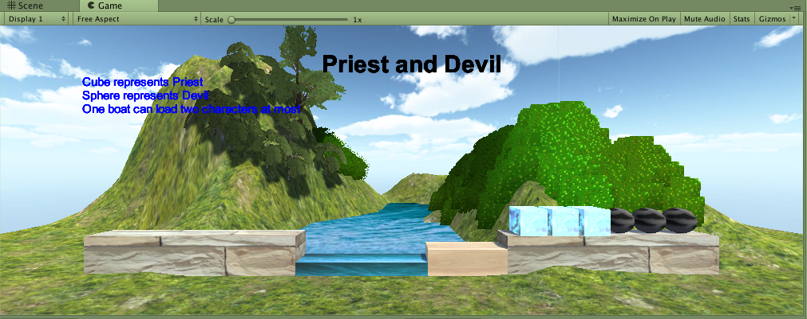
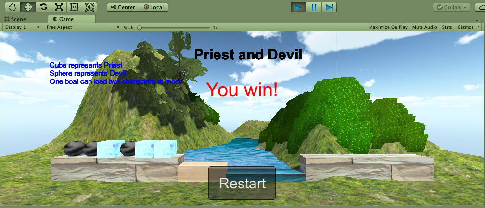
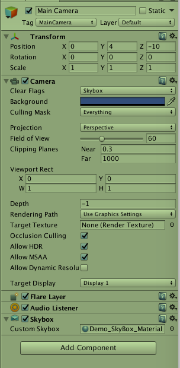
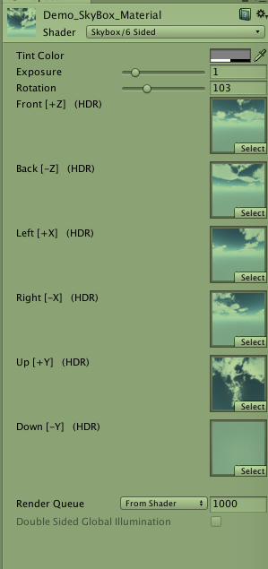
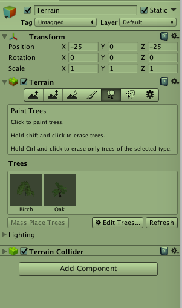

[TOC]


# 三、游戏对象与图形基础

## 课程实践：Unity中使用多个相机

- 中文 [在Unity中使用多个相机 - 及其重要性](http://www.manew.com/thread-47076-1-1.html)
- 原文 [Using Multiple Unity Cameras – Why This May Be Important?](http://blog.theknightsofunity.com/using-multiple-unity-cameras-why-this-may-be-important/)

## 作业与练习

### **自学资源**

#### 用户手册

- [图形元素](https://docs.unity3d.com/Manual/GraphicsOverview.html)
- [声音元素](https://docs.unity3d.com/Manual/AudioOverview.html)

#### c# 结构体

不负责的连接： http://www.cnblogs.com/kissdodog/archive/2013/05/11/3072832.html

#### C# 枚举与常数

不负责任的连接： http://www.cnblogs.com/kissdodog/archive/2013/01/16/2863515.html

### **作业内容**

#### 1、操作与总结

- 参考 Fantasy Skybox FREE 构建自己的游戏场景
  1. 修改了游戏场景中的Terrain
  2. 下载Assets美化Skybox和为Terrain添加Textures。
  3. 添加树和草的prefabs实现种树种草。













- 写一个简单的总结，总结游戏对象的使用

1. 游戏对象有很多方法：
   - 通过GameObject菜单栏中创建 
   - 通过代码实例化预设
   - 克隆游戏对象
   - GameObject.Find()


2. 可以添加许多组件，其中Transform为必需组件
3. 游戏对象 (GameObject) 还具有标记 (Tag)、层 (Layer) 和名称 (Name)。
4. 在父子对象间传送消息
5. 为其添加shader渲染，成为一个material


#### 2、编程实践

- 牧师与魔鬼 动作分离版

1. 利用课件中的框架进行简单修改

2. 将之前的控制游戏对象动作的Moveable组件取消，而是由简单动作和组合动作完成。

3. FirstController只关心ActionManager的行为，再通过其为游戏对象添加简单动作和组合动作。

部分修改代码：

```c#
//SceneActionManager.cs
using System.Collections;
using System.Collections.Generic;
using UnityEngine;

public class SceneActionManager : SSActionManager,ISSActionCallback {

	public void MoveBoat(BoatController boat){
		CCMoveToActions action = CCMoveToActions.GetSSAction(boat.getDestination(),20);
		this.RunAction (boat.getGameobj (), action, this);
	}

	public void MoveCharacter(CharacterController _characterCtrl,Vector3 des) {

		Vector3 pos = _characterCtrl.getPos();
		Vector3 mid = pos;
		if (des.y > pos.y)	
			mid.y = des.y;
		else 
			mid.x = des.x;
      
		SSAction action1 = CCMoveToActions.GetSSAction(mid, 40);
		SSAction action2 = CCMoveToActions.GetSSAction (des, 40);
		SSAction action = CCSequenceAction.GetSSAction (1, 0, new List<SSAction>{ action1, action2 });
		this.RunAction (_characterCtrl.getGameobj (), action, this);
	}
	public new void SSActionEvent(SSAction source){}
}

//FirstController.cs
public void moveBoat() {
//		if (userGUI.status == 1 || userGUI.status == 2)
//			return;
		if (boat.isEmpty ())
			return;
//		boat.Move ();
//		Debug.Log(actionManager);
		actionManager.MoveBoat(boat);	
		boat.move ();	
		userGUI.status = check_game_over ();
	}

	public void characterIsClicked(CharacterController _characterCtrl) {
//		if (userGUI.status == 1 || userGUI.status == 2)
//			return;
		if (_characterCtrl.isOnBoat ()) {
			CoastController whichCoast;
			if (boat.get_to_or_from () == -1) { // to->-1; from->1
				whichCoast = rightCoast;
			} else {
				whichCoast = leftCoast;
			}

			boat.GetOffBoat (_characterCtrl.getName());
//			_characterCtrl.moveToPosition (whichCoast.getEmptyPosition ());

			actionManager.MoveCharacter (_characterCtrl, whichCoast.getEmptyPosition ());

			_characterCtrl.getOnCoast (whichCoast);
			whichCoast.getOnCoast (_characterCtrl);
	
		} else {	
			
			CoastController whichCoast = _characterCtrl.getCoastController ();

			if (boat.getEmptyIndex () == -1) {		// boat is full
				return;
			}

			if (whichCoast.get_to_or_from () != boat.get_to_or_from ())	// boat is not on the side of character
				return;
			whichCoast.getOffCoast(_characterCtrl.getName());
//			_characterCtrl.moveToPosition (boat.getEmptyPosition());
				
			actionManager.MoveCharacter (_characterCtrl,boat.getEmptyPosition());


			_characterCtrl.getOnBoat (boat);
			boat.GetOnBoat (_characterCtrl);
		}
		userGUI.status = check_game_over ();
	}

//CCSequenceAction.cs
using System.Collections;
using System.Collections.Generic;
using UnityEngine;

public class CCSequenceAction : SSAction,ISSActionCallback {

	public List<SSAction> sequence;
	public int repeat = -1;//repeat forever
	public int start = 0;

	public static CCSequenceAction GetSSAction(int repeat,int start,List<SSAction> sequence){
		CCSequenceAction action = ScriptableObject.CreateInstance<CCSequenceAction> ();
		action.repeat = repeat;
		action.sequence = sequence;
		action.start = start;
		return action;
	}

	// Use this for initialization
	public override void Start () {
		foreach (SSAction action in sequence) {
			action.gameobject = this.gameobject;
			action.transform = this.transform;
			action.callback = this;
			action.Start ();
		}
	}
	
	// Update is called once per frame
	public override void Update () {
		if (sequence.Count == 0)
			return;
		if (start < sequence.Count) {
			sequence [start].Update ();
		}
	}

	public void SSActionEvent(SSAction source){
		source.destory = false;
		this.start++;
		if (this.start >= sequence.Count) {
			this.start = 0;
			if (repeat > 0)
				repeat--;
			if (repeat == 0) {
				this.destory = true;
				this.callback.SSActionEvent (this);
			}
		}
	}

	public void OnDestroy(){
		foreach (SSAction ac in sequence) {
			DestroyObject (ac);
		}
	}
	
}


//CCMoveToAction.cs
using System.Collections;
using System.Collections.Generic;
using UnityEngine;

public class CCMoveToActions : SSAction {

	public Vector3 target;
	public float speed;

	public static CCMoveToActions GetSSAction(Vector3 target,float speed){
		CCMoveToActions action = ScriptableObject.CreateInstance<CCMoveToActions> ();
		action.target = target;
		action.speed = speed;
		return action;
	}

	public override void Start (){}

	public override void Update(){
		this.transform.position = Vector3.MoveTowards (this.transform.position, target, speed * Time.deltaTime);
		if (this.transform.position == target) {
			this.destory = true;
			this.callback.SSActionEvent (this);
		}
	}

}

//SSAction.cs
using System.Collections;
using System.Collections.Generic;
using UnityEngine;

public class SSAction : ScriptableObject {

	public bool enable = true;
	public bool destory = false;

	public GameObject gameobject{ get; set;}
	public Transform transform { get; set;}
	public ISSActionCallback callback{ get; set;}

	protected SSAction(){}

	public virtual void Start(){
		throw new System.NotImplementedException ();
	}

	public virtual void Update(){
		throw new System.NotImplementedException ();
	}

}


//SSActionManager.cs
using System.Collections;
using System.Collections.Generic;
using UnityEngine;

public class SSActionManager : MonoBehaviour {


	private Dictionary<int, SSAction> actions = new Dictionary<int, SSAction> ();
	private List<SSAction> waitingAdd = new List<SSAction>();
	private List<int> waitingDelete = new List<int>();

	protected void Update() {
		foreach (SSAction ac in waitingAdd) {
			actions[ac.GetInstanceID()] = ac;
		}
		waitingAdd.Clear();
		foreach (KeyValuePair<int, SSAction> kv in actions) {
			SSAction ac = kv.Value;
			if (ac.destory) {
				waitingDelete.Add(ac.GetInstanceID());
			} else if (ac.enable) {
				ac.Update();
			}
		}
		foreach(int key in waitingDelete) {
			SSAction ac = actions[key];
			actions.Remove(key);
			DestroyObject(ac);
		}
		waitingDelete.Clear();
	}

	public void RunAction(GameObject gameobject, SSAction action, ISSActionCallback manager) {
		action.gameobject = gameobject;
		action.transform = gameobject.transform;
		action.callback = manager;
		waitingAdd.Add(action);
		action.Start();
	}

	public void SSActionEvent(SSAction source){}

	protected void Start() {}
}

```

